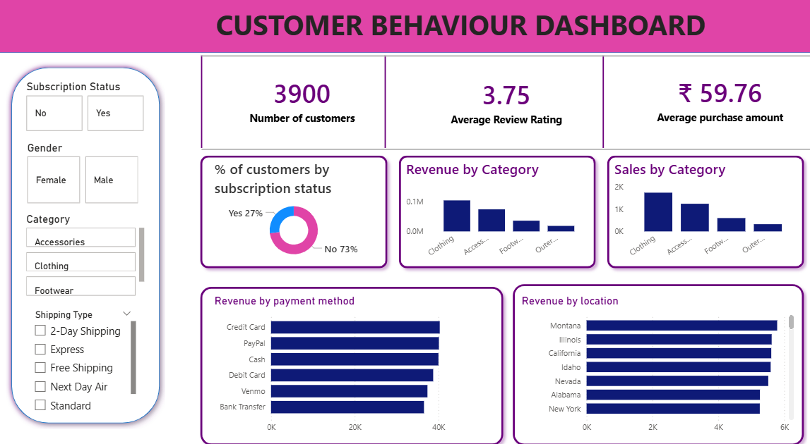

# Customer Behaviour Analysis

## 📌 Project Overview

Customer Behaviour Analysis is an end-to-end data analytics project developed to analyze customer shopping behaviour and generate meaningful business insights.

This project uses **Python, SQL, and Power BI** to perform data cleaning, exploratory data analysis, business analysis, and interactive dashboard development.

The project follows a complete data analytics workflow:

**Data Cleaning → Python Analysis → SQL Analysis → Power BI Dashboard → Business Insights**

---

## 🎯 Business Objective

The main objective of this project is to understand customer purchasing behaviour and identify patterns that can help businesses make data-driven decisions.

The analysis focuses on:

- Customer purchasing behaviour
- Purchase amount and revenue
- Product performance
- Customer segments
- Gender-wise purchasing behaviour
- Discount usage
- Product ratings
- Shipping preferences
- Customer spending patterns

---

## 🛠️ Tools & Technologies

- **Python**
- **Pandas**
- **NumPy**
- **Matplotlib**
- **Jupyter Notebook**
- **MySQL**
- **SQL**
- **Power BI**
- **Power Query**
- **DAX**

---

## 📊 Dataset

The project uses customer shopping behaviour data containing customer, product, purchase, rating, discount, and shipping-related information.

The dataset was analyzed to understand customer purchasing patterns and business performance.

---

# 🔄 Project Workflow

## 1. Python – Data Cleaning & Exploratory Data Analysis

Python was used to clean, explore, and analyze the customer shopping dataset.

### Activities performed:

- Loaded the dataset
- Inspected the dataset structure
- Checked data types
- Checked for missing values
- Cleaned and transformed the data
- Performed exploratory data analysis
- Analyzed customer purchasing behaviour
- Analyzed product and purchase patterns
- Created visualizations to understand trends

### Python Libraries Used

- Pandas
- NumPy
- Matplotlib

### Python File

`customer_shopping_behaviour_analysis.ipynb`

---

# 2. SQL – Business Analysis

SQL was used to perform business-oriented analysis and answer practical business questions.

### Business Questions Analyzed

- What is the total revenue generated by male vs. female customers?
- Which customers used a discount but still spent more than the average purchase amount?
- Which are the top 5 products with the highest average review rating?
- What is the average purchase amount for different shipping types?
- What purchasing patterns can be identified from the customer data?

### SQL Concepts Used

- SELECT
- WHERE
- GROUP BY
- ORDER BY
- Aggregate Functions
- SUM()
- AVG()
- COUNT()
- Subqueries
- Filtering
- Sorting

### SQL File

`customer_behavior_sql_queries.sql`

---

# 3. Power BI – Interactive Dashboard

Power BI was used to create an interactive dashboard to visualize the customer behaviour analysis.

### Dashboard Analysis Includes

- Customer behaviour
- Purchase performance
- Product performance
- Customer segments
- Gender-wise analysis
- Discount usage
- Shipping preferences
- Product ratings
- Key Performance Indicators (KPIs)
- Purchasing patterns

### Power BI Features Used

- Power Query
- Data Transformation
- Data Cleaning
- Data Modeling
- DAX Measures
- KPI Cards
- Charts
- Interactive Visualizations
- Slicers / Filters

### Power BI File

`customer_behavior_dashboard.pbix`

## 📊 Power BI Dashboard

An interactive Power BI dashboard was developed to analyze customer shopping behaviour and present key business insights in an easy-to-understand visual format.

### Dashboard Analysis

The dashboard provides insights into:

- Customer purchasing behaviour
- Sales and purchase performance
- Product performance
- Customer segments
- Gender-wise purchasing behaviour
- Discount usage
- Shipping preferences
- Product ratings
- Key Performance Indicators (KPIs)

### Power BI Features Used

- Power Query for data cleaning and transformation
- Data modeling
- DAX measures
- KPI cards
- Interactive charts and visualizations
- Slicers and filters


## 📊 Dashboard Preview

The Power BI dashboard provides an interactive view of customer behaviour, sales performance, customer segments, product performance, payment methods, and location-based insights.



*Power BI Dashboard:* customer_behavior_dashboard.pbix
---

# 📈 Key Business Insights

The analysis helps identify:

- Revenue contribution from different customer segments
- Customer purchasing patterns
- High-performing and highly rated products
- Customer spending behaviour
- Discount utilization patterns
- Shipping preferences
- Differences in purchasing behaviour across customer segments

These insights can help businesses improve customer understanding and support data-driven decisions.

---

# 📁 Project Structure

```text
customer-behaviour-analysis/
│
├── README.md
│
├── customer_shopping_behaviour_analysis.ipynb
│
├── customer_behavior_sql_queries.sql
│
└── customer_behavior_dashboard.pbix


| File | Description |
|---|---|
| README.md | Project documentation |
| customer_shopping_behaviour_analysis.ipynb | Python data cleaning and analysis |
| customer_behavior_sql_queries.sql | SQL business analysis queries |
| customer_behavior_dashboard.pbix | Power BI interactive dashboard |

# 💡 Skills Demonstrated

This project demonstrates practical skills in:

- Data Cleaning
- Data Analysis
- Exploratory Data Analysis
- SQL
- Python
- Pandas
- NumPy
- Matplotlib
- MySQL
- Power BI
- Power Query
- DAX
- Data Visualization
- Business Analysis
- KPI Analysis

# 🚀 Project Outcome

This project demonstrates an end-to-end data analytics workflow, from raw customer data to meaningful business insights.

Python was used for data preparation and exploratory analysis, SQL was used to answer business questions, and Power BI was used to create an interactive dashboard for presenting insights.

The project demonstrates how data can be transformed into actionable insights to support business decision-making.

## 👩‍💻 Author

*Kowsalya s*

Aspiring Data Analyst | Business Analyst

*Skills:* Python | SQL | Power BI | Excel | Data Analytics

